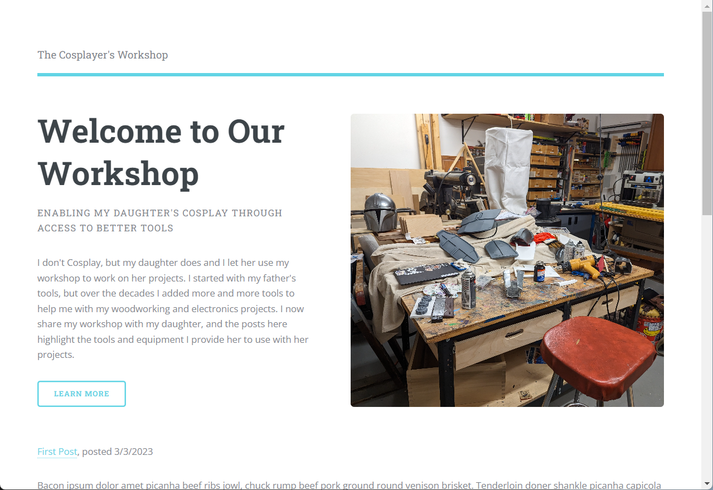

# Cosplayer Workshop

My first [eleventy](https://www.11ty.dev/) site. I'm building this using [Raymond Camden](https://www.raymondcamden.com/)'s [A Guide to Building a Blog in Eleventy](https://cfjedimaster.github.io/eleventy-blog-guide/guide.html)

My daughter uses my workshop to build her costumes and props, and there are a lot of interesting tools there that make her work easier. I'm starting this site to:

1. Learn Eleventy
2. Document some of the cool tools I have that Cosplayers (people who Cosplay) can use to simplify their work

This site is a work in progress, but should be fun putting together.

